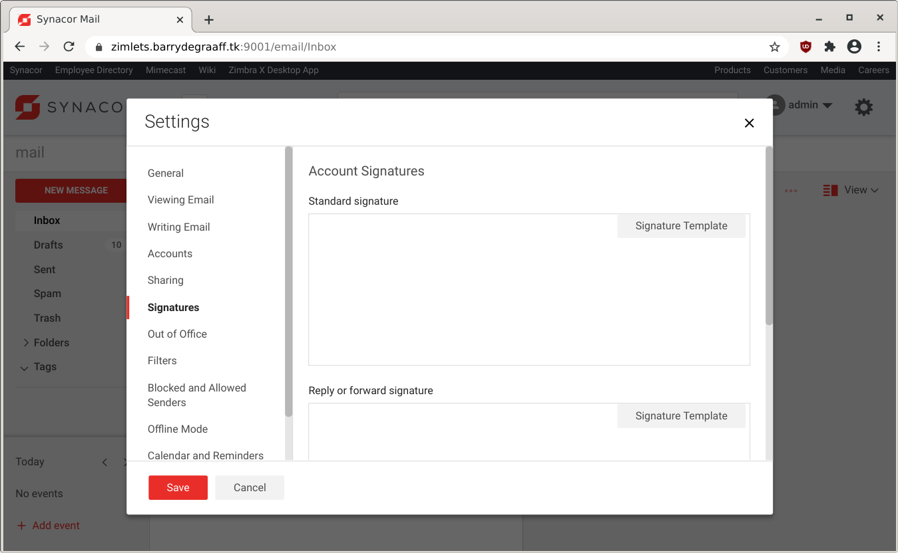
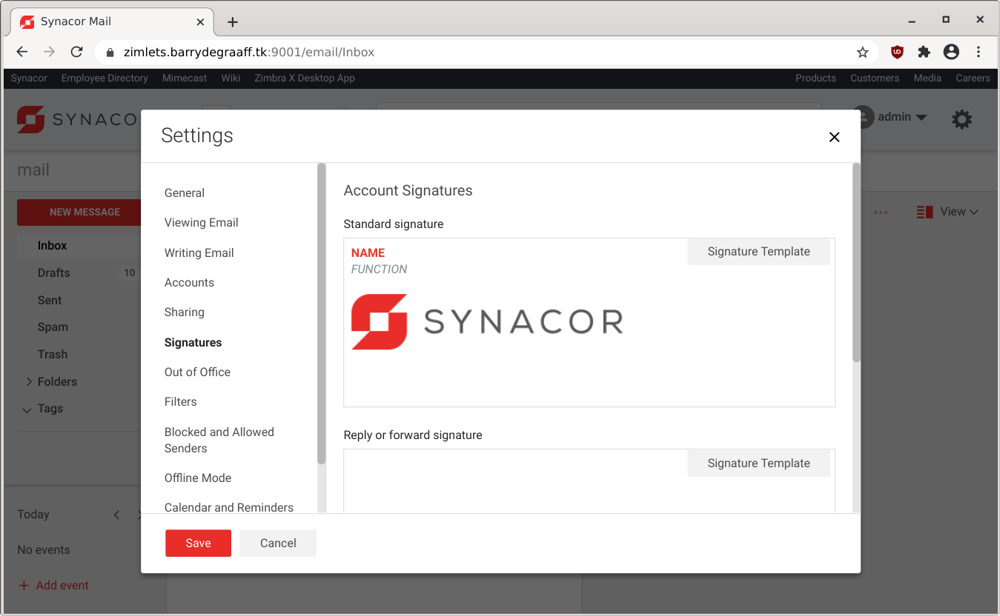
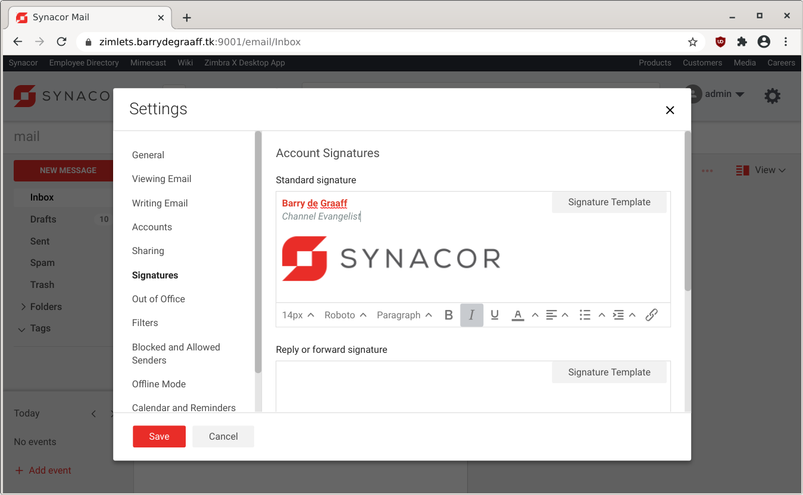
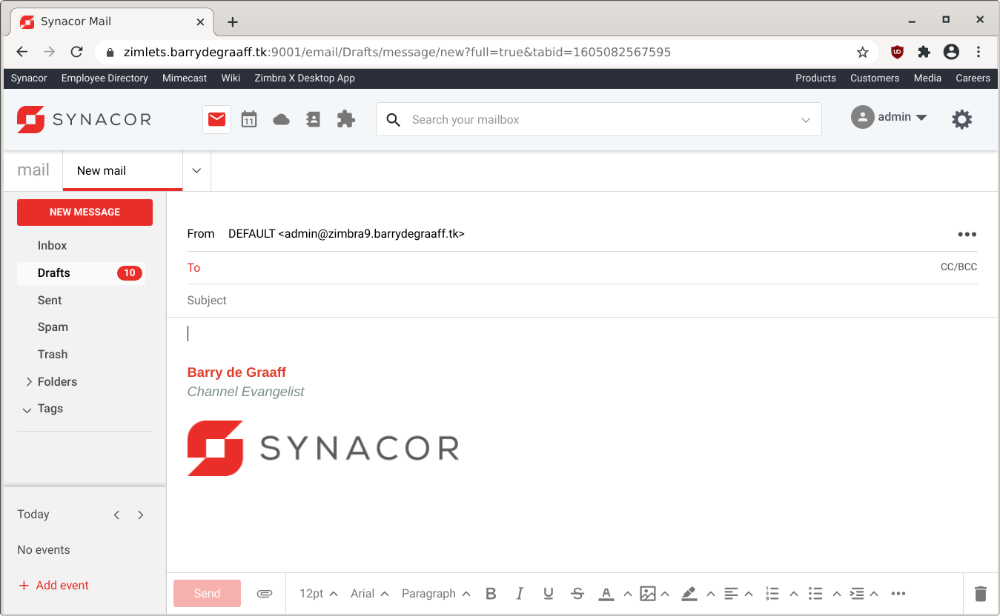

# Interact with Zimbra Composer using Zimlets - Signature Template

This article introduces you to the new Zimlet Slow `editor`. This Zimlet Slot allows you to write Zimlets that interact with Zimbra's composer component. The composer is based on TinyMCE and is used when writing new emails and when configuring email signatures in preferences.

This article will show you how to write a simple Signature Template Zimlet. The Signature Template Zimlet offers a globally configured email signature template that users can use to configure their email signature. This way all users in an organization can have a uniform signature.

## Screenshots


*Signature Template button added by Zimlet.*


*Signature loaded once button is clicked.*


*User fills in the blanks*


*Final result when writing an email.*


## Installing the Zimlet

This Zimlet uses Global Zimlet Configuration as described in https://github.com/Zimbra/zimbra-zimlet-configuration. To install this Zimlet:

      cd /tmp
      wget https://github.com/Zimbra/zimbra-zimlet-signature-template/download/0.0.2/zimbra-zimlet-signature-template.zip
      zmzimletctl deploy /tmp/zimbra-zimlet-signature-template.zip

To make changes to the configuration one first gets the configuration template:

      zmzimletctl getConfigTemplate /tmp/zimbra-zimlet-signature-template.zip > /tmp/myconfig.xml

Review and make changes to /tmp/myconfig.xml using vi or nano and deploy using:

      zmzimletctl configure  /tmp/myconfig.xml

The config_template.xml file has the following structure:

```xml
<zimletConfig name="zimbra-zimlet-signature-template" version="0.0.1">
    <global>
        <property name="htmlTemplate">PGRpdj48c3BhbiBzdHlsZT0iY29sb3I6ICNlMDNlMmQ7Ij48c3Ryb25nPk5BTUU8L3N0cm9uZz48L3NwYW4+PC9kaXY+PGRpdj48ZW0+PHNwYW4gc3R5bGU9ImNvbG9yOiAjN2U4YzhkOyI+RlVOQ1RJT048L3NwYW4+PC9lbT48YnIvPjxici8+PGltZyBzcmM9Imh0dHBzOi8vczIyLnE0Y2RuLmNvbS80NzYzMjUxMzcvZmlsZXMvZGVzaWduL3N5bmFjb3ItbG9nby0yMDE2LXJnYi5wbmciPjwvaW1nPjwvZGl2Pgo=</property>
    </global>
</zimletConfig>

```

The `htmlTemplate` is a base64 encoded HTML template for use with the email signature. You can use an online tool like https://www.base64decode.org/ to encode/decode the HTML template.

## Development notes

Please note that it is not possible to side-load config_template.xml files. So you must always deploy an actual Zimlet to read the configuration properties.

A pre packed version of the example Zimlet used in this article can be downloaded from 
https://github.com/Zimbra/zimbra-zimlet-signature-template/download/0.0.2/zimbra-zimlet-signature-template.zip.

See: https://github.com/Zimbra/zimbra-zimlet-configuration.

## The Zimlet in Preferences->Signatures

The file src/components/more-menu/index.js implements the `Signature Template` button in Settings->Signatures. The in-code comments explain how it works:

```javascript
import { createElement, Component } from 'preact';
import { withIntl } from '../../enhancers';
import { withText } from 'preact-i18n';

@withIntl()
@withText({
    title: 'zimbra-zimlet-signature-template.title'
})
export default class MoreMenu extends Component {
    constructor(props) {
        super(props);
        this.zimletContext = props.children.context;

        //Get all zimlets
        const zimlets = this.zimletContext.getAccount().zimlets;

        this.globalConfig = new Map();

        //Get the current zimlet
        const zimlet = zimlets.zimlet.find(zimlet => zimlet.zimlet[0].name === "zimbra-zimlet-signature-template");

        //Add zimlet configuration properties to an ES6 Map
        if (zimlet) {
            const globalConfig = zimlet.zimletConfig[0].global[0].property || [];
            for (let i = 0; i < globalConfig.length; i++) {
                this.globalConfig.set(globalConfig[i].name, window.atob(globalConfig[i].content));
            };
        }
        //https://developer.mozilla.org/en-US/docs/Web/JavaScript/Reference/Global_Objects/Map
        //now you can get a property value by doing: this.globalConfig.get('name-of-property')
    };

    //Use this.props.editor.setContent to replace the contents of the composer textarea
    handleClick = e => {
        this.props.composer.editor.setContent(this.globalConfig.get('htmlTemplate'));
    }

    render() {
        //Only show the Zimlet in the UI where we want it.

        //if (this.props.composer.editor.id.indexOf('zimbra-composer') > -1) {
        //We are in the email composer
        //}
        if (this.props.composer.editor.id.indexOf('zimbra-compact-editor') > -1) {
            //We are in the signature composer, let's show the button
            return (
                <div style="float:right">
                    <button onClick={this.handleClick} type="button" class="blocks_button_button blocks_button_regular zimbra-client_settings_subsectionBodyButton">{this.props.title}</button></div>
            );
        }
    }
}
```

## References

- https://wiki.zimbra.com/wiki/Zimlet_Developers_Guide:Zimlet_Configuration_File_Reference
- https://wiki.zimbra.com/wiki/Zimlets,_Setting_Up
- https://github.com/Zimbra/zimlet-cli/wiki/Store-configurations-of-zimlet-using-Zimlet-Config
